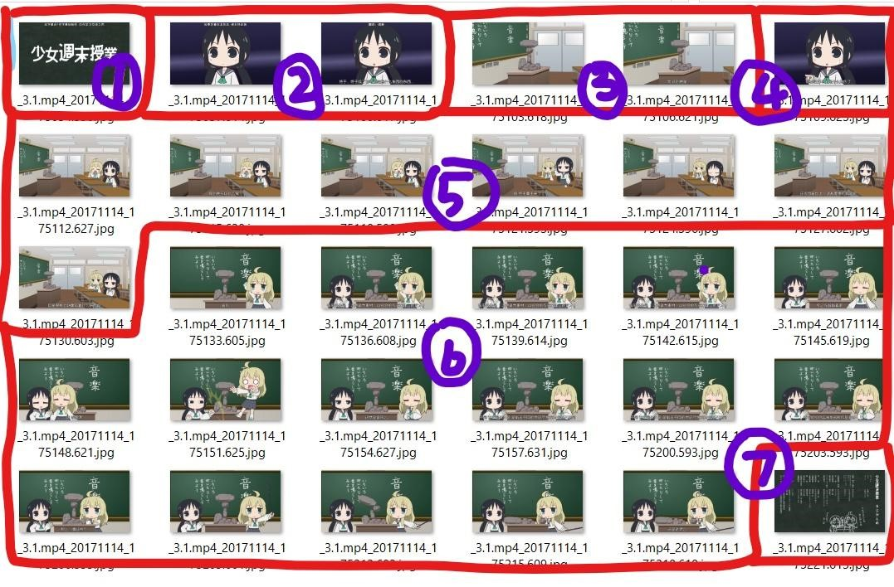
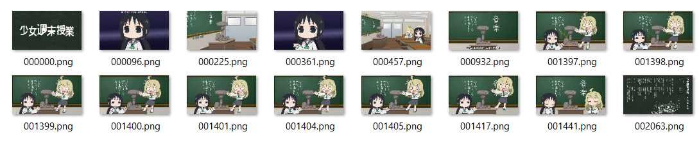
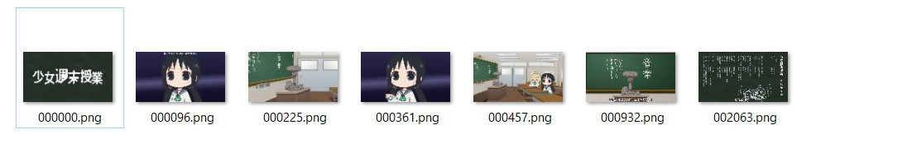

# 视频镜头边界检测常用技术报告

[TOC]

## 一、什么是视频镜头边界检测

> 一个镜头是相机的一次连续拍摄，代表的是时间和空间上的一组连续的动作，是一系列相互关联的连续帧的组合。

镜头边界，就是一个镜头和另一个镜头之间的分界。

更加形象地解释，下文是《辛德勒的名单》的电影剧本的开头：

> **1 黑白片**
> > 火车轮子在铁轨上滚动，渐渐地慢下来。折叠桌的腿交叉地打开了。火车上的一扇门被打开。文书拿着文件夹，上面写着名字，这些人名重叠地出现在移动着的轨道上。
> >	
> > ……
> 
> **2 内景 旅馆的一间房)克拉科夫)波兰)夜**
> > 那首歌是从一台无线电收音机中播出的，收音机放在生锈的水池架上。
> > 
> > ……

电影的画面从室外转到室内, 这就是两个镜头的切换. 这两个镜头之间的分界, 就是视频镜头的边界. 

镜头边界检测, 就是检测镜头的边界, 从而区别出两个镜头, 使得我们能够更加方便地单独地处理单一的镜头.

镜头边界检测的应用非常广泛, 任何涉及视频数据处理的应用领域都会用到镜头边界检测. 因此, 寻找一种快速又准确的视频镜头边界检测技术是非常必要的.

## 二、视频镜头边界检测技术

就我来看, 一个非常简单的想法是: 给每一帧的图像计算它的模样, 如果连续两帧之间的模样差别大于某一阙值, 就认为它们是两个不同的镜头.

博客上有更科学的解释:

> 一般在同一个镜头中，相邻的图像帧是相似的，所以可以通过检测相邻图像帧特征的突变来实现。以下是经典的几种算法。这些算法其实都离不开重要的两点，怎么定义图像的特征，怎么判定相似。

在本文中, 将介绍比较常见的几种算法, 如连续帧法, 直方图相减法.

### 2.1 连续帧法

在镜头边界检测算法中像素比较法是最简单的一种检测帧间距离的算法. 算法的核心思想是: 计算两相邻图像帧之间对应位置上的灰度值之差是否大于一个提前设定好的门限值, 如果大于这一门限值, 就认为该位置上的像素发生了变化, 统计两相邻图像帧之间所有发生变化的像素点, 根据发生变化的像素点占总像素点的比例来确定镜头是否发生变换.

更加定量地表述这个算法, 用 $(x,y)$ 表示该像素点在图像帧中的位置, $d(x,y)$ 表示该像素点是否变化, $dif$ 表示相邻两图像帧之间像素值差的绝对值, $dif_0$ 表示提前设定好的门限值, 若 $dif>dif_0$ , 则相应位置像素点发生变化, $d(x,y)$ 用 $1$ 表示, 若 $dif<dif_0$ , 则相应位置像素点未发生变化, $d(x,y)$ 用 $0$ 表示. 然后根据 $1$ 的占比和设定的阙值 $k$ 比较, 若比 $k$ 大, 那就是另一个镜头, 若比 $k$ 小, 那就是同一个镜头.

接下来给出一个例子.

采用的样本是动画「少女终末旅行」的小剧场第五话, 全长1分30秒, 共有7个镜头. 以下是利用播放器每3,000ms截图的结果:



使用如上算法编写程序, 为加快速度, 源文件像素1280x720, 修正为128x72. 核心代码如下:

```python
import cv2
import time
import numpy as np

cap = cv2.VideoCapture('3.1.avi')   # 打开视频
k = 7000    # 阙值参数 k

_, pre = cap.read()
cv2.imwrite('Capture\\000000.png', pre)
    cnt = 0
	
	while True:
	    _, cur = cap.read()
	    curHeight, curWidth, _ = cur.shape
	    dif = 0
	    for i in range(curHeight):
	        for j in range(curWidth):
	            if pre[i][j][0] != cur[i][j][0]:
	                dif = dif + 1
	            elif pre[i][j][1] != cur[i][j][1]:
	                dif = dif + 1
	            elif pre[i][j][2] != cur[i][j][2]:
	                dif = dif + 1
	    if dif > k:
	        print(cnt)
	        filename = 'Capture\\{:0>6d}.png'.format(cnt)
	        cv2.imwrite(filename, cur)
	    cnt = cnt + 1
	    pre = cur
 
	cap.release()
	cv2.destroyAllWindows()
```

得到的结果如下:



可以看到这种算法完美地解析了第1, 2, 3, 4, 5, 7个镜头, 然而却在第6个镜头的检测上失败了. 原因很简单, 第6个镜头的这个部分(指第1400帧左右的地方), 镜头发生了整体偏移, 每一个位置上的灰度值都发生了变化, 从而被认为镜头发生了转换.

博客:

> 它的不足之处是没有考虑到噪声的影响，对摄像机的运动与镜头内物体的运动都比较的敏感。
> 
> 也提出了一种解决方案: 一种改进的方法是在对像素点比较之前，先用均值滤波器对待检测图像帧进行平滑滤波处理，去掉部分噪声，从而降低物体运动对检测结果的影响。

### 2.2 直方图相减法

直方图相减法的核心思想是: 先把整个颜色空间(如RGB颜色空间)划分为若干个颜色区间, 然后统计图像帧中落入每个颜色区间的像素点个数, 通过进行归一化处理后, 就可以得到该图像帧的颜色直方图, 计算相邻图像帧之间颜色直方图的差值, 如果这个差值大于一个提前设定好的门限值, 则认为镜头发生变换. 颜色直方图比较法可以用以下的公式表示: 

其中 $D(n,n+1)$ 为第 $n$ 帧和第 $n+1$ 帧的帧间差, $N$ 为图像的颜色等级数, 一般为256,  $d(i,n)$ 为第n帧图像颜色直方图中颜色值为 $i$ 的像素总数. 可以定义一个指标 $Hd$, 其公式表示为(是我自己推的公式, 可能会不优美):

$$
Hd=∑_1^N|d(i,n)/tot-d(i,n+1)/tot|
$$

其中 $tot$ 为图像的总像素数, 其值固定不变. 只要 $Hd$ 越大, 相邻两帧的图像就越不相似,是镜头边界的可能性就越大.

同样是动画「少女终末旅行」的小剧场第五话, 全长1分30秒, 共有7个镜头.

核心代码:

```python
import cv2
import time
import numpy as np

def rbg2grey(x):
    r, b, g = x[0] // 32, x[1] // 32, x[2] // 32
    return r * 64 + b * 8 + g

cap = cv2.VideoCapture('3.1.avi')
# 阙值参数 k
k = 7000
_, pre = cap.read()
cv2.imwrite('Capture\\000000.png', pre)
cnt = 0
while True:
    try:
        _, cur = cap.read()
        curHeight, curWidth, _ = cur.shape
        preG = [0 for i in range(512)]
        curG = [0 for i in range(512)]
        dif = 0
        for i in range(curHeight):
            for j in range(curWidth):
                preG[rbg2grey(pre[i][j])] += 1
                curG[rbg2grey(cur[i][j])] += 1
        for i in range(512):
            dif += abs(preG[i] - curG[i])
        print(dif)
        if dif > k:
            print(cnt)
            filename = 'Capture\\{:0>6d}.png'.format(cnt)
            cv2.imwrite(filename, cur)
        cnt = cnt + 1
        pre = cur
    except AttributeError:
        break

cap.release()
cv2.destroyAllWindows()
```

镜头边界检测结果:



完美!
从结果来看, 比起连续帧法, 直方图相减法显然展现出了对运动图的更高的容忍度. 这是一种基于全局颜色特征的统计方法, 和运动, 形状, 旋转等操作基本无关. 由于这种对运动等信息不敏感的特性, 使得许多从视觉上感觉不太相似的图像帧, 只要全局颜色相似, 就不会误判镜头.

当然, 我没有提到的问题是, 颜色域的划分. 

在写代码的过程中, 我遇到了一个问题: RBG总共有几种颜色? 计算发现共有`256*256*256`种, 这是一个庞大的数字. 为了简化, 我只取了`8*8*8`. 但是我用的仅仅是一个简单的视频(况且动画所产生的误差比实际应用中要少许多), 当需要更加精确的统计时, 时间复杂度和空间复杂度将直线上升.

## 三、参考

[几种简单常用的镜头边缘检测算法(matlab实现)](http://blog.csdn.net/numb623/article/details/8738534)

[几种常用镜头边界检测技术介绍](http://blog.csdn.net/numb623/article/details/8738534)

[给深度学习入门者的Python快速教程 - 番外篇之Python-OpenCV](https://zhuanlan.zhihu.com/p/24425116)
