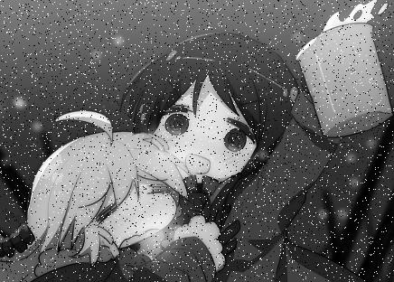
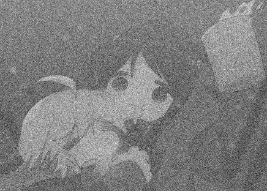
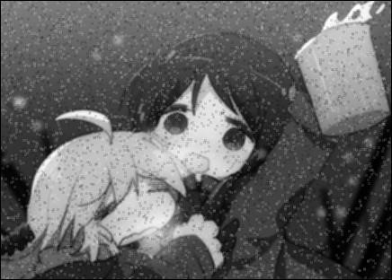
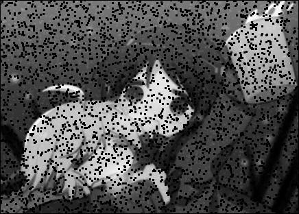
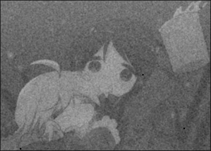
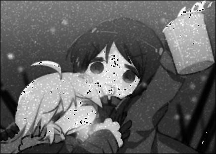
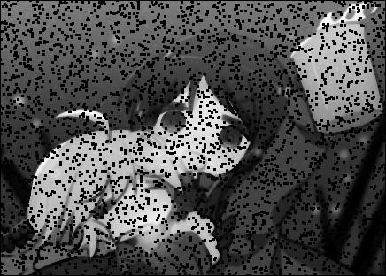
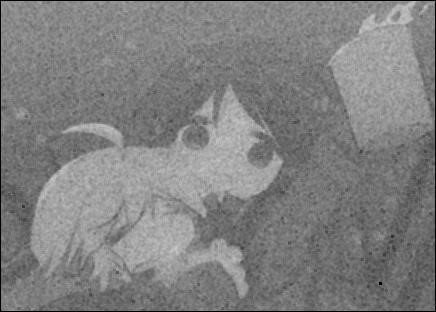

# 噪声复原

## 分析

**算术均值滤波器**简单易操作, 对所有类型的噪声都有一定抑制作用, 但是效果并不理想, 同时也会丢失较多的细节.

**几何均值滤波器**同算术均值滤波器一样, 有一定效果并不理想的抑制噪声作用, 但是可以更少的丢失细节, 相较算术均值滤波器而言. 另外, 几何均值滤波器对椒盐噪声中的盐类噪声有很好的去除作用, 相反对椒类噪声反而有放大作用.

**和几何均值滤波器**一样, 谐波滤波器对椒盐噪声很无力, 对某些椒类噪声会有很惨烈的效果. 同时它对高斯噪声的抑制作用直观来看并不比算术或者几何均值滤波器要好.

**逆谐波滤波器**个性鲜明, 当Q为正时, 这个滤波器可以去除胡椒噪声, 当Q为负时, 这个滤波器可以去除盐粒噪声. 对高斯噪声去除效果马马虎虎.

## 原图和噪声

**原图**


**椒盐噪声**(5%比例添加)



**高斯噪声**(添加均值为 0, 标准差为 64 的加性高斯白噪声)



## 算数均值滤波器

**滤波椒盐噪声**



**滤波高斯噪声**


## 几何均值滤波器

**滤波椒盐噪声**



**滤波高斯噪声**



## 谐波滤波器

**滤波椒盐噪声**



**滤波高斯噪声**


## 逆谐波滤波器

**滤波椒盐噪声**(Q=1.5)


**滤波椒盐噪声**(Q=-1.5)



**滤波高斯噪声**(Q=1.5)


**滤波高斯噪声**(Q=-1.5)



## 代码

```python
# -*- coding: utf-8 -*-
import cv2
import numpy as np
import matplotlib
import math
import random

# 生成椒盐噪声
def PepperNoise(src):
    dst = np.zeros(src.shape)
    for i in range(src.shape[0]):
        for j in range(src.shape[1]):
            r = random.randint(1, 100)
            # 5% 几率添加噪声
            if r <= 5:
                if random.randint(0, 1):
                    dst[i][j] = 0
                else:
                    dst[i][j] = 255
            else:
                dst[i][j] = src[i][j]
    return dst.astype(np.uint8)

# 生成高斯噪声
def GuassNoise(src):
    # 添加均值为 0, 标准差为 64 的加性高斯白噪声
    dst = src + np.random.normal(0, 64, src.shape)
    if np.min(dst) >= 0 and np.max(dst) <= 255:
        return dst
    else:
        dst = dst - np.full(dst.shape, np.min(dst))
        dst = dst * 255 / np.max(dst)
        return dst.astype(np.uint8)

# 算术均值滤波
def ArithmeticFilter(src):
    n = 3
    p = np.ones((n, n)) / n ** 2
    dst = np.zeros(src.shape)
    for i in range(dst.shape[0]):
        for j in range(dst.shape[1]):
            if i < n // 2 or j < n // 2 or i >= dst.shape[0] - n // 2 or j >= dst.shape[1] - n // 2:
                continue
            sub = src[i - n // 2:i + n // 2 + 1, j - n // 2:j + n // 2 + 1]
            dst[i][j] = np.sum(sub * p)
    return dst.astype(np.uint8)

# 几何均值滤波
def GeometricFilter(src):
    n = 3
    dst = np.zeros(src.shape)
    for i in range(dst.shape[0]):
        for j in range(dst.shape[1]):
            if i == 0 or j == 0 or i == dst.shape[0] - 1 or j == dst.shape[1] - 1:
                continue
            sub = src[(i - n // 2):(i + n // 2 + 1), (j - n // 2):(j + n // 2 + 1)]
            p = 1
            for _i in range(sub.shape[0]):
                for _j in range(sub.shape[1]):
                    p *= int(sub[_i][_j])
            dst[i][j] = p ** (1. / 9.)
    return dst.astype(np.uint8)

# 谐波滤波
def HarmonicFilter(src):
    n = 3
    dst = np.zeros(src.shape)
    for i in range(dst.shape[0]):
        for j in range(dst.shape[1]):
            if i == 0 or j == 0 or i == dst.shape[0] - 1 or j == dst.shape[1] - 1:
                continue
            sub = src[(i - n // 2):(i + n // 2 + 1), (j - n // 2):(j + n // 2 + 1)]
            s = 0
            for _i in range(sub.shape[0]):
                for _j in range(sub.shape[1]):
                    if sub[_i][_j] == 0:
                        continue
                    s += 1.0 / float(sub[_i][_j])
            try:
                dst[i][j] = float(n * n) / s
            except:
                continue
    return dst.astype(np.uint8)

# 逆谐波均值滤波
def InverseHarmonicFilter(src):
    n = 3
    q = -1.5
    dst = np.zeros(src.shape)
    for i in range(dst.shape[0]):
        for j in range(dst.shape[1]):
            if i == 0 or j == 0 or i == dst.shape[0] - 1 or j == dst.shape[1] - 1:
                continue
            sub = src[(i - n // 2):(i + n // 2 + 1), (j - n // 2):(j + n // 2 + 1)]
            sub_ = sub ** q
            sub__ = sub ** (q + 1)
            dst[i][j] = np.sum(sub__) / np.sum(sub_)
    return dst.astype(np.uint8)
```